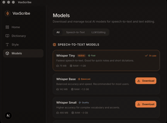

# Wispr Flow

Privacy-first local AI voice dictation with real-time speech-to-text, intelligent text editing, and global text injection.

## Preview



## Why This Project

I built Wispr Flow because voice input should be private, fast, and work everywhere — without sending your words to the cloud.
Goal: let users dictate into any app with real-time transcription and AI-powered text cleanup, all running locally.

Context:
- The average person types 40 WPM but speaks 130 WPM — voice is 3x faster.
- Cloud-based dictation tools send every word to remote servers, raising privacy concerns for sensitive work.
- Existing local solutions lack intelligent editing — they transcribe raw speech without fixing filler words, grammar, or tone.

Sources:
- https://www.ncbi.nlm.nih.gov/pmc/articles/PMC6456571/
- https://hai.stanford.edu/news/speech-faster-typing
- https://www.eff.org/deeplinks/2023/08/your-voice-your-data

## Standout Features

- Real-time voice capture with Web Audio API and live waveform visualization.
- Browser-native speech-to-text via SpeechRecognition API with interim results.
- Three edit modes: Raw (no changes), Light Edit (grammar + filler removal), Aggressive Rewrite (full tone transformation).
- Tone selector: Casual, Professional, or Concise output styles.
- Canvas-based waveform visualizer with bar and wave rendering modes.
- Dictation history with copy-to-clipboard support.
- Configurable model selection UI (STT + LLM) ready for Tauri/local model integration.
- Keyboard shortcut support (Space to toggle recording).
- Dark-mode-first glassmorphism UI designed to feel like a native desktop app.

## Tech Stack

- Next.js 16 + React 19 + TypeScript
- Tailwind CSS v4 + shadcn/ui
- Web Audio API (AnalyserNode for real-time frequency data)
- SpeechRecognition API (browser-native STT)
- Canvas API (waveform rendering)
- Tauri-ready architecture (IPC structure documented for Rust backend)

## System Architecture


**Data Flow:** Mic --> Audio Capture --> Whisper STT --> Raw Text --> LLM Edit --> Edited Text --> Global Keyboard Injection --> Active App

```text
                    ┌─────────────────────────────────────────┐
                    │            Tauri Application             │
                    │                                         │
                    │  ┌───────────────────────────────────┐  │
                    │  │       Frontend (React/Svelte)      │  │
                    │  │                                   │  │
                    │  │  Floating     Waveform   Settings │  │
                    │  │  Mic Widget   Display    Panel    │  │
                    │  └──────────────┬────────────────────┘  │
                    │                 │ IPC (invoke/events)    │
                    │  ┌──────────────▼────────────────────┐  │
                    │  │       Rust Backend (Tauri)         │  │
                    │  │                                   │  │
                    │  │  ┌─────────────┐ ┌────────────┐  │  │
                    │  │  │ Audio       │ │ Global     │  │  │
                    │  │  │ Capture     │─│ Hotkey     │  │  │
                    │  │  │ (cpal)      │ │ (rdev)     │  │  │
                    │  │  └──────┬──────┘ └────────────┘  │  │
                    │  │         │ audio stream            │  │
                    │  │  ┌──────▼──────┐                  │  │
                    │  │  │Transcription│ whisper.cpp      │  │
                    │  │  │  Engine     │ [Background]     │  │
                    │  │  └──────┬──────┘                  │  │
                    │  │         │ raw transcript           │  │
                    │  │  ┌──────▼──────┐                  │  │
                    │  │  │ LLM Edit   │ llama.cpp /      │  │
                    │  │  │ Engine     │ Ollama HTTP      │  │
                    │  │  └──────┬──────┘                  │  │
                    │  │         │ edited text              │  │
                    │  │  ┌──────▼──────┐                  │  │
                    │  │  │ Keyboard   │ enigo            │  │
                    │  │  │ Injection  │ → active app     │  │
                    │  │  └─────────────┘                  │  │
                    │  └───────────────────────────────────┘  │
                    └─────────────────────────────────────────┘
```

## Project Structure

```text
app/
├── layout.tsx                         # root layout with dark theme + Inter font
├── page.tsx                           # main app orchestration + state management
└── globals.css                        # oklch color tokens + custom design system

components/
├── mic-button.tsx                     # animated mic toggle with glow + audio level
├── waveform-visualizer.tsx            # canvas-based real-time audio visualization
├── transcript-display.tsx             # raw vs edited text with diff highlighting
├── edit-mode-toggle.tsx               # Raw / Light Edit / Rewrite + tone selector
├── settings-panel.tsx                 # model config, audio device, custom prompts
├── status-bar.tsx                     # recording state, duration, hotkey hints
└── history-panel.tsx                  # past dictations with copy + delete

hooks/
├── use-audio-engine.ts                # Web Audio API capture + frequency analysis
└── use-transcription.ts               # SpeechRecognition + local text editing pipeline
```

## Typing into other apps (desktop)

To have dictated text appear in Apple Notes, Terminal, or any app:

1. **Same shortcut everywhere** — **Hold** **Ctrl+D** (Mac: Control+D) to record; **release** to stop and paste. From any app; text is pasted where your cursor is. Or use the tray / mic to toggle start and stop.
2. **macOS: Accessibility** — Typing into other apps uses simulated keypresses (clipboard + Cmd+V). You must add the app under **System Settings → Privacy & Security → Accessibility**. **When running from source (dev build)** the app appears as **"app"** with a generic icon: add it via **+** → **Cmd+Shift+G** → `src-tauri/target/debug` → select **app**. **After building** (`pnpm tauri build`), the app appears as **VoxScribe** with the VoxScribe icon in the list, like other branded apps. Without Accessibility permission, paste will not go to the focused app.
3. **macOS: No dock icon** — On Mac, the app runs as an "accessory" so it does not steal focus when you press the global hotkey from Notes or another app. You open the window from the **menu bar tray** (click the icon). This keeps the target app in focus so the paste goes there.

You can also use the menu bar tray: **Start / stop dictation (Ctrl+D)**.

## Quick Run

```bash
pnpm install
pnpm dev
```

No environment variables required — everything runs locally in the browser.
